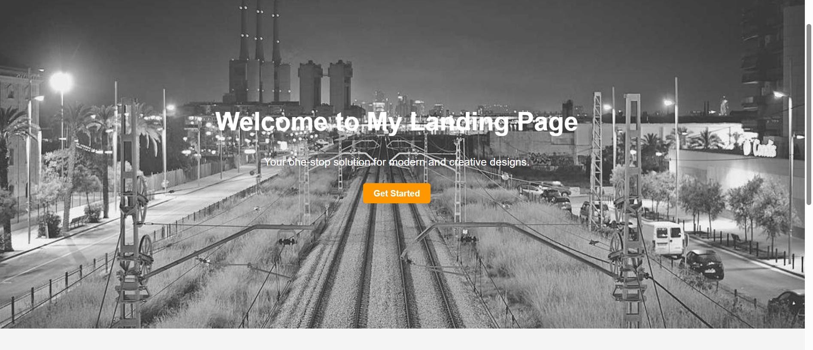
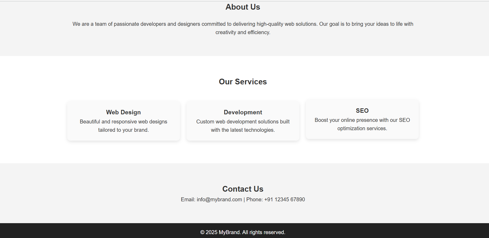

# 🌐 NEXTLIFE Landing Page

Welcome to the **NEXTLIFE Landing Page** — a modern, responsive, and minimalistic website template built with **HTML & CSS**.  
This project is designed to showcase your brand, services, and contact details in a clean and professional manner.

---

## 📖 Description

The landing page includes all essential sections to present your brand effectively:

- **Header / Navigation Bar** – Fixed top navigation with links to different sections  
- **Hero Section** – Eye-catching background image with headline and CTA button  
- **About Section** – Introduces your brand and values  
- **Services Section** – Highlights key offerings in a structured layout  
- **Contact Section** – Simple contact details for quick communication  
- **Footer** – Branding and copyright  

---

## 🌐 Live Demo

👉 [View Live Site](https://sidhant-codes.github.io/landing-page/)

---

## 🎯 Features

- 📱 **Responsive Design** – Works seamlessly on desktop, tablet, and mobile devices  
- 🎨 **Modern UI** – Clean layout with smooth typography and spacing  
- ⚡ **Fast & Lightweight** – Pure **HTML & CSS**, no external frameworks  
- 🖼️ **Hero Background** – Full-screen image for a bold first impression  
- 🔎 **SEO-friendly Structure** – Organized semantic HTML  

---

## 🛠️ Technologies Used

- **HTML5** – Structure and semantic layout  
- **CSS3** – Styling, responsiveness, and hover effects  

---

## 🖼️ Screenshots

  
  

## 📜 License

This project is open-source and available under the [MIT License](LICENSE).

## 👨‍💻 Author

**Sidhant Bisht**

- 🌐 GitHub: [@sidhant-codes](https://github.com/sidhant-codes)  
- 📧 Email: sidhantbisht1006@gmail.com
